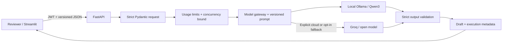

# Architecture and boundaries

The UI cannot bypass authentication. The gateway owns provider-specific HTTP formats and output
validation; FastAPI owns contracts and usage enforcement. HTTP inference uses async I/O. Password
verification runs in a thread to avoid blocking the event loop. Dependency injection provides the
authenticated identity, and the app factory injects configuration/gateway doubles for tests.

JWTs use HS256 with required expiry, subject and issuance claims plus issuer/audience verification.
Credentials are Argon2id-hashed. Secrets are generated locally, never embedded in the image or repo.
The API does not log ticket bodies, passwords, tokens or upstream error bodies.

Auto fallback is bounded to one cloud attempt for configured availability failures. Explicit Local
never falls back. Invalid structured output is rejected. Provider timeouts, concurrency limits and
request caps bound resource use. There is no autonomous tool execution or external customer action.

`/healthz` checks API liveness only. `/api/v1/providers` separately reports whether Ollama has the
configured model and whether a cloud key exists; cloud configuration is not proof of connectivity.

The model is external to the application container. This keeps the app image small and lets native
Ollama use the host GPU. Versioned dependencies live in `uv.lock`; the selected model name is
configurable. Record the actual model digest during evaluation for repeatability.
